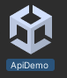

[English](README.md) ｜ 日本語

このリポジトリは、PX4と連携可能なUnityで作られたドローンシミュレータです。

このシミュレータは、リアルタイムでのドローン飛行のシミュレーションや、飛行制御アルゴリズムのテストなどに使用できます。

ネイティブWindowsで箱庭ドローンシミュレータを利用されたい方は、[こちら](README-win.md)を参照ください。

# 目次

- [箱庭ドローンモデル](#箱庭ドローンモデル)
- [PX4との連携について](#px4との連携について)
- [サポート環境](#サポート環境)
  - [Mac環境](#mac環境)
  - [Windows環境](#windows-環境)
- [利用手順](#利用手順)
  - [Unityアプリを利用する場合](#unityアプリを利用する場合)
  - [Unityエディタを利用する場合](#unityエディタを利用する場合)
- [コミュニティとサポート](#コミュニティとサポート)
- [本リポジトリの内容とライセンスについて](#本リポジトリの内容とライセンスについて)
- [貢献ガイドライン](#貢献ガイドライン)

# 箱庭ドローンモデル

Unityで作られたドローンモデルは、箱庭オリジナルモデルであり、クアッドコプター型でのものです（下図）。


箱庭ドローンモデルH1 のUnityアセットは,  中村歩高さんより提供いただいたデータを基に作成しています．箱庭へのOSS貢献に深く感謝いたします．


# PX4との連携について

このドローンシミュレータをPX4と連携させるには、別途 hakoniwa-px4sim リポジトリが必要です。PX4との連携方法については、以下のリンク先に詳細な説明がありますので、ご一読ください。

https://github.com/toppers/hakoniwa-px4sim

# サポート環境

- [X] Intel系 Mac
- [X] Arm系 Mac
- [X] Ubuntu
- [X] Windows 10/11

# 利用手順
Unity向け箱庭ドローンモデルは、以下の２つの利用形態があります。

1. Unityアプリを利用する場合
2. Unityエディタを利用する場合

1 については、ビルド済みのアプリケーションを利用しますので、セットアップの手間は発生しません。

2 については、Unityエディタを利用しますので、セットアップの手間が発生します。

## Unityアプリを利用する場合

### Unityアプリを利用する場合の必要な環境

Unity関連の環境は特に必要ありません。

### Unityアプリを利用する場合のインストール方法

本リポジトリを以下のようにクローンします。

```
git clone --recursive https://github.com/toppers/hakoniwa-unity-drone-model.git
```

クローンが終わったら、以下のようにディレクトリ移動します。

```
cd hakoniwa-unity-drone-model/
```

以下のサイトから、ご利用環境に応じたアプリケーションをダウンロードしてください。

https://github.com/toppers/hakoniwa-unity-drone-model/releases

ダウンロードしたzipファイルを `hakoniwa-unity-drone-model` の下で解凍してください。

以下のディレクトリ構成になります。

```
hakoniwa-unity-drone-model/DroneApp<OS>
```

### Unityアプリの起動方法

`hakoniwa-unity-drone-model` 直下でコマンドを実行してください。

```
bash ./plugin/activate_app.bash DroneApp<OS>
```

Windows ネイティブアプリの場合は、`DroneWinNative/model.exe` をダブルクリックします。

成功するとUnityアプリケーションが起動します。


## Unityエディタを利用する場合

### Unityエディタを利用する場合に必要な環境

- Homebrew(Mac版のみ)
- Unity Hub
- Unity（各CPUアーキテクチャに対応したもの）
  - 2022.3.5f1 以降

### Unityエディタを利用する場合のインストール方法

本リポジトリを以下のようにクローンします。

```
git clone --recursive https://github.com/toppers/hakoniwa-unity-drone-model.git
```

クローンが終わったら、以下のようにディレクトリ移動します。

```
cd hakoniwa-unity-drone-model/
```

そして、必要な Unity モジュール類をインストールします。

MacOS/Ubuntu　および WSL2　の場合：

```
bash install.bash 
```

Winodws　の場合：

```
bash install.bash win
```


### Unity起動

この状態で Unity Hub で当該プロジェクトを開きましょう。

注意：Unityエディタは、当該CPUアーキテクチャに対応したものをインストールしてご利用ください。

対象フォルダ：hakoniwa-unity-drone-model\plugin\plugin-srcs

Unityのバージョン違いに起因するメッセージ（"Opening Project in Non-Matching Editor Installation"）が出る場合は、「Continue」として問題ありません。

以下のダイアログが出ますが、`Continue` してください。


次に、以下のダイアログが出ますので、`Ignore` してください。


成功するとこうなります。


起動直後の状態ですと、コンソール上にたくさんエラーが出ています。原因は以下の２点です。
リンク先を参照して、順番に対応してください。

* [Newtonsoft.Json が不足している](https://github.com/toppers/hakoniwa-document/tree/main/troubleshooting/unity#unity%E8%B5%B7%E5%8B%95%E6%99%82%E3%81%ABnewtonsoftjson%E3%81%8C%E3%81%AA%E3%81%84%E3%81%A8%E3%81%84%E3%81%86%E3%82%A8%E3%83%A9%E3%83%BC%E3%81%8C%E5%87%BA%E3%82%8B)
* [gRPC のライブラリ利用箇所がエラー出力している](https://github.com/toppers/hakoniwa-document/blob/main/troubleshooting/unity/README.md#grpc-%E3%81%AE%E3%83%A9%E3%82%A4%E3%83%96%E3%83%A9%E3%83%AA%E5%88%A9%E7%94%A8%E7%AE%87%E6%89%80%E3%81%8C%E3%82%A8%E3%83%A9%E3%83%BC%E5%87%BA%E5%8A%9B%E3%81%97%E3%81%A6%E3%81%84%E3%82%8B)(MacまたはLinuxのとき)


### シミュレーション環境の準備

下図のように、Unity のシーン（`Assets/Scenes/ApiDemo`）をダブルクリックします。




#### コンフィグファイルを出力

そして、`Window` -> `Hakoniwa` -> `Generate` をクリックします。


成功すると、コンソール上にエラーログ出力がなく、下図のように json のログが出力されています。


Windowsの場合、本オペレーションは、マシン再起動時に必ず再実行してください。

#### コンフィグファイル

生成されたコンフィグファイルですが、`hakoniwa-unity-drone-model\plugin\plugin-srcs` 直下に生成されます。

* [core_config.json](https://github.com/toppers/hakoniwa-document/blob/main/architecture/assets/README-unity.md#%E7%AE%B1%E5%BA%AD%E3%82%B3%E3%83%B3%E3%83%95%E3%82%A3%E3%82%B0%E3%83%95%E3%82%A1%E3%82%A4%E3%83%AB%E5%85%A5%E5%8A%9Bcore_configjson)
* custom.json

custom.jsonの出力は以下の通りとなります。


```json
{
  "robots": [
    {
      "name": "DroneTransporter",
      "rpc_pdu_readers": [],
      "rpc_pdu_writers": [],
      "shm_pdu_readers": [
        {
          "type": "hako_mavlink_msgs/HakoHilActuatorControls",
          "org_name": "drone_motor",
          "name": "DroneTransporter_drone_motor",
          "class_name": "Hakoniwa.PluggableAsset.Communication.Pdu.Raw.RawPduReader",
          "conv_class_name": "Hakoniwa.PluggableAsset.Communication.Pdu.Raw.RawPduReaderConverter",
          "channel_id": 0,
          "pdu_size": 112,
          "write_cycle": 1,
          "method_type": "SHM"
        },
        {
          "type": "geometry_msgs/Twist",
          "org_name": "drone_pos",
          "name": "DroneTransporter_drone_pos",
          "class_name": "Hakoniwa.PluggableAsset.Communication.Pdu.Raw.RawPduReader",
          "conv_class_name": "Hakoniwa.PluggableAsset.Communication.Pdu.Raw.RawPduReaderConverter",
          "channel_id": 1,
          "pdu_size": 72,
          "write_cycle": 1,
          "method_type": "SHM"
        },
        {
          "type": "hako_msgs/ManualPosAttControl",
          "org_name": "drone_manual_pos_att_control",
          "name": "DroneTransporter_drone_manual_pos_att_control",
          "class_name": "Hakoniwa.PluggableAsset.Communication.Pdu.Raw.RawPduWriter",
          "conv_class_name": "Hakoniwa.PluggableAsset.Communication.Pdu.Raw.RawPduWriterConverter",
          "channel_id": 3,
          "pdu_size": 80,
          "write_cycle": 1,
          "method_type": "SHM"
        },
        {
          "type": "hako_msgs/HakoDroneCmdTakeoff",
          "org_name": "drone_cmd_takeoff",
          "name": "DroneTransporter_drone_cmd_takeoff",
          "class_name": "Hakoniwa.PluggableAsset.Communication.Pdu.Raw.RawPduWriter",
          "conv_class_name": "Hakoniwa.PluggableAsset.Communication.Pdu.Raw.RawPduWriterConverter",
          "channel_id": 5,
          "pdu_size": 64,
          "write_cycle": 1,
          "method_type": "SHM"
        },
        {
          "type": "hako_msgs/HakoDroneCmdMove",
          "org_name": "drone_cmd_move",
          "name": "DroneTransporter_drone_cmd_move",
          "class_name": "Hakoniwa.PluggableAsset.Communication.Pdu.Raw.RawPduWriter",
          "conv_class_name": "Hakoniwa.PluggableAsset.Communication.Pdu.Raw.RawPduWriterConverter",
          "channel_id": 6,
          "pdu_size": 80,
          "write_cycle": 1,
          "method_type": "SHM"
        },
        {
          "type": "hako_msgs/HakoDroneCmdLand",
          "org_name": "drone_cmd_land",
          "name": "DroneTransporter_drone_cmd_land",
          "class_name": "Hakoniwa.PluggableAsset.Communication.Pdu.Raw.RawPduWriter",
          "conv_class_name": "Hakoniwa.PluggableAsset.Communication.Pdu.Raw.RawPduWriterConverter",
          "channel_id": 7,
          "pdu_size": 64,
          "write_cycle": 1,
          "method_type": "SHM"
        },
        {
          "type": "hako_msgs/GameControllerOperation",
          "org_name": "hako_cmd_game",
          "name": "DroneTransporter_hako_cmd_game",
          "class_name": "Hakoniwa.PluggableAsset.Communication.Pdu.Raw.RawPduWriter",
          "conv_class_name": "Hakoniwa.PluggableAsset.Communication.Pdu.Raw.RawPduWriterConverter",
          "channel_id": 8,
          "pdu_size": 136,
          "write_cycle": 1,
          "method_type": "SHM"
        },
        {
          "type": "hako_msgs/HakoCmdCamera",
          "org_name": "hako_cmd_camera",
          "name": "DroneTransporter_hako_cmd_camera",
          "class_name": "Hakoniwa.PluggableAsset.Communication.Pdu.Raw.RawPduWriter",
          "conv_class_name": "Hakoniwa.PluggableAsset.Communication.Pdu.Raw.RawPduWriterConverter",
          "channel_id": 9,
          "pdu_size": 44,
          "write_cycle": 1,
          "method_type": "SHM"
        },
        {
          "type": "hako_msgs/HakoCmdCameraMove",
          "org_name": "hako_cmd_camera_move",
          "name": "DroneTransporter_hako_cmd_camera_move",
          "class_name": "Hakoniwa.PluggableAsset.Communication.Pdu.Raw.RawPduWriter",
          "conv_class_name": "Hakoniwa.PluggableAsset.Communication.Pdu.Raw.RawPduWriterConverter",
          "channel_id": 11,
          "pdu_size": 64,
          "write_cycle": 1,
          "method_type": "SHM"
        },
        {
          "type": "hako_msgs/HakoCmdMagnetHolder",
          "org_name": "hako_cmd_magnet_holder",
          "name": "DroneTransporter_hako_cmd_magnet_holder",
          "class_name": "Hakoniwa.PluggableAsset.Communication.Pdu.Raw.RawPduWriter",
          "conv_class_name": "Hakoniwa.PluggableAsset.Communication.Pdu.Raw.RawPduWriterConverter",
          "channel_id": 13,
          "pdu_size": 40,
          "write_cycle": 1,
          "method_type": "SHM"
        }
      ],
      "shm_pdu_writers": [
        {
          "type": "hako_msgs/Collision",
          "org_name": "drone_collision",
          "name": "DroneTransporter_drone_collision",
          "class_name": "Hakoniwa.PluggableAsset.Communication.Pdu.Raw.RawPduWriter",
          "conv_class_name": "Hakoniwa.PluggableAsset.Communication.Pdu.Raw.RawPduWriterConverter",
          "channel_id": 2,
          "pdu_size": 304,
          "write_cycle": 1,
          "method_type": "SHM"
        },
        {
          "type": "hako_msgs/Disturbance",
          "org_name": "drone_disturbance",
          "name": "DroneTransporter_drone_disturbance",
          "class_name": "Hakoniwa.PluggableAsset.Communication.Pdu.Raw.RawPduWriter",
          "conv_class_name": "Hakoniwa.PluggableAsset.Communication.Pdu.Raw.RawPduWriterConverter",
          "channel_id": 4,
          "pdu_size": 32,
          "write_cycle": 1,
          "method_type": "SHM"
        },
        {
          "type": "hako_msgs/HakoCameraData",
          "org_name": "hako_camera_data",
          "name": "DroneTransporter_hako_camera_data",
          "class_name": "Hakoniwa.PluggableAsset.Communication.Pdu.Raw.RawPduWriter",
          "conv_class_name": "Hakoniwa.PluggableAsset.Communication.Pdu.Raw.RawPduWriterConverter",
          "channel_id": 10,
          "pdu_size": 102968,
          "write_cycle": 1,
          "method_type": "SHM"
        },
        {
          "type": "hako_msgs/HakoCameraInfo",
          "org_name": "hako_cmd_camera_info",
          "name": "DroneTransporter_hako_cmd_camera_info",
          "class_name": "Hakoniwa.PluggableAsset.Communication.Pdu.Raw.RawPduWriter",
          "conv_class_name": "Hakoniwa.PluggableAsset.Communication.Pdu.Raw.RawPduWriterConverter",
          "channel_id": 12,
          "pdu_size": 56,
          "write_cycle": 1,
          "method_type": "SHM"
        },
        {
          "type": "hako_msgs/HakoStatusMagnetHolder",
          "org_name": "hako_status_magnet_holder",
          "name": "DroneTransporter_hako_status_magnet_holder",
          "class_name": "Hakoniwa.PluggableAsset.Communication.Pdu.Raw.RawPduWriter",
          "conv_class_name": "Hakoniwa.PluggableAsset.Communication.Pdu.Raw.RawPduWriterConverter",
          "channel_id": 14,
          "pdu_size": 32,
          "write_cycle": 1,
          "method_type": "SHM"
        },
        {
          "type": "sensor_msgs/PointCloud2",
          "org_name": "lidar_points",
          "name": "DroneTransporter_lidar_points",
          "class_name": "Hakoniwa.PluggableAsset.Communication.Pdu.Raw.RawPduWriter",
          "conv_class_name": "Hakoniwa.PluggableAsset.Communication.Pdu.Raw.RawPduWriterConverter",
          "channel_id": 15,
          "pdu_size": 177400,
          "write_cycle": 5,
          "method_type": "SHM"
        },
        {
          "type": "geometry_msgs/Twist",
          "org_name": "lidar_pos",
          "name": "DroneTransporter_lidar_pos",
          "class_name": "Hakoniwa.PluggableAsset.Communication.Pdu.Raw.RawPduWriter",
          "conv_class_name": "Hakoniwa.PluggableAsset.Communication.Pdu.Raw.RawPduWriterConverter",
          "channel_id": 16,
          "pdu_size": 72,
          "write_cycle": 5,
          "method_type": "SHM"
        }
      ]
    }
  ]
}
```


# コミュニティとサポート

このプロジェクトに関する質問やディスカッションは、[箱庭コミュニティフォーラム](https://github.com/toppers/hakoniwa/discussions)で行われています。ここでは、プロジェクトに関する疑問の解消、アイデアの共有、フィードバックの提供ができます。また、プロジェクトの最新情報やアップデートについても、ここで情報共有されます。

プロジェクトに関する質問や提案がある場合、または同じ問題に直面している他のユーザーと意見交換をしたい場合は、遠慮なく[こちら](https://github.com/toppers/hakoniwa/discussions)に投稿してください。


# 本リポジトリの内容とライセンスについて

本リポジトリのコンテンツに関しては、各ファイルにライセンスが明記されている場合、そのライセンスに従います。特に明記されていないコンテンツについては、[TOPPERSライセンス](https://www.toppers.jp/license.html) に基づいて公開されています。

TOPPERSライセンスは、オープンソースプロジェクトのためのライセンスであり、ソフトウェアの使用、変更、配布に関する条件を定めています。ライセンスの詳細については、上記リンクを参照してください。

# 貢献ガイドライン

本プロジェクトへの貢献に興味を持っていただき、ありがとうございます。様々な形での貢献を歓迎しています。以下に、プロジェクトへの貢献方法についてのガイドラインを示します。

## イシューの報告

- バグの報告や新機能の提案などは、GitHubのIssuesを通じて行ってください。
- issue を作成する前に、同様の issue が既に存在しないかを確認してください。
- issue を作成する際は、できるだけ多くの情報を提供してください。再現手順、期待される挙動、実際の挙動、使用している環境などが含まれます。

## プルリクエスト

- 機能追加やバグ修正など、コードに関する貢献はプルリクエストを通じて行ってください。
- 新機能の追加や大きな変更の場合は、事前に関連する issue  で議論を行うことを推奨します。
- コードのスタイルやコーディング規約に一貫性を持たせるため、既存のコードスタイルに従ってください。

## コミュニケーション

- プロジェクトに関するディスカッションや質問は、[Discussions](https://github.com/toppers/hakoniwa/discussions)で行ってください。
- 他の貢献者とのコミュニケーションは、敬意を持って行ってください。

## その他の貢献

- ドキュメントの改善や翻訳など、コード以外の貢献も歓迎します。
