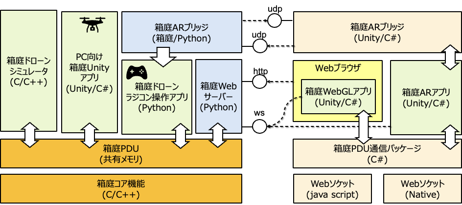

# はじめに

本ドキュメントでは、v2.8.0以降の箱庭ドローンシミュレータをARアプリと連携するための方法を説明します。

なお、QUEST3アプリの作成手順については、[こちら](./README-quest3.md)を参照ください。

# 必要な環境セット

- Mac(AppleSilicon)
- PS4コントローラ
- QUEST3
- Wi-Fi環境
- [Mac版箱庭ドローンシミュレータ](https://github.com/toppers/hakoniwa-px4sim/blob/main/docs/manual/mac_install&operation_pythonAPI%E7%B7%A8.md)
  - PS4コントローラで箱庭ドローンを操作できる必要がありますので、事前に準備ください。

# アーキテクチャ

最新の「箱庭ARブリッジ」のアーキテクチャ図を以下に示します。



各コンポーネントの役割は以下の通りです：

- **箱庭ドローンシミュレータ**
  - [hakoniwa-px4sim](https://github.com/toppers/hakoniwa-px4sim)です。

- **PC向け箱庭Unityアプリ**
  - Unityを利用した箱庭Unityアプリが、箱庭PDU（共有メモリ）を介して箱庭コア機能にアクセスします。
  - ROSConJP 2024向けのデモ環境では、TB3や箱庭ドローンが動作します。

- **箱庭ドローンラジコン操作アプリ**
  - PS4コントローラで箱庭ドローンを操作するためのアプリケーションです。
  - 箱庭ドローンシミュレータで数値シミュレーションされたドローンをラジコン操作で移動させることができます。
  - 箱庭PDU（共有メモリ）を介して箱庭コア機能にアクセスします。

- **箱庭コア機能**
  - [hakoniwa-core-cpp-client](https://github.com/toppers/hakoniwa-core-cpp-client)です。

- **箱庭Webサーバー**
  - シミュレーションデータをWebGLアプリやARデバイスから取得できるようにする役割です。
  - WebSocketを通してWebGLアプリおよびARデバイスとそう方向通信することができます。

- **WebGLアプリおよびARデバイス**
  - WebSocketを介して箱庭Webサーバーと接続し、シミュレーションデータの送受信が可能となります。

- **箱庭PDU通信パッケージ**
  - 箱庭PDUデータをC#言語で利用するための通信パッケージです。
  - WebSocket実装が2つあるのは、WebGLとARデバイスの実装依存をなくすためであり、アプリのランタイム要件に応じて切り替えできる機能を用意しています。
    - WebGL向け：JavaScriptベース
    - ARアプリ向け：Native WebSocketベース

- **箱庭ARブリッジ**
  - 箱庭側とARアプリ側に組み込むことで、以下の機能を利用できます。
    - ARアプリでWebサーバーのURIの取得
    - AR空間の原点調整
    - アプリダウンやネットワーク切断発生時の自動再接続機能
  - いずれもUDP通信を通じて行います。
  - デモ環境では、ネットワーク構成が変わる/ネットワークが不安定である場合がありますし、
  - 開発中のARアプリ/箱庭アプリが不安定な場合は、再起動が頻繁に起こるケースありますので、
  - 箱庭AR体験を行うためのシステム運用をかなり容易にすることができます！
  
# ドローン位置調整と操作手順

- QUEST3のアプリ起動直後
  - AR座標の原点を調整するモード（ドローン位置調整モード）に入り待機します。
- 箱庭ARブリッジの起動
  - 箱庭側で箱庭ARブリッジを起動すると、QUEST3と通信を行い、PS4コントローラで原点調整が可能になります。
  - 起動順番はどちらからでも行えます。
- 位置調整完了後
  - ⚪︎ボタンを押下すると、ドローン操作が可能になります。

# 事前準備

## 箱庭用PCの環境設定

以下から、DroneAppAppleSilicon.zip をダウンロードしてください。

https://github.com/toppers/hakoniwa-unity-drone-model/releases/tag/v2.8.0


DroneAppAppleSilicon.zip をお好みの場所で解凍してください。

また、ドローン操作および位置合わせは、PS4コントローラを使いますので、事前にUSB接続しておいてください。

以下のリポジトリをクローンします。

```
git clone --recursive https://github.com/toppers/hakoniwa-ar-bridge.git
```

```
git clone --recursive https://github.com/toppers/hakoniwa-webserver.git
```


### 設定ファイル

QUEST3と箱庭用PCは互いにUDP通信するため、設定ファイルにて、IPアドレスを指定しておく必要があります。

設定ファイルは、[hakoniwa-ar-bridge](https://github.com/toppers/hakoniwa-ar-bridge)/asset_lib/config 直下に、`ar_bridge_config.json`が配置されていますので、そこに適切なIPアドレスを設定する必要があります。

書式は以下の通り。

```json
{
    "web_ip": "192.168.2.100",
    "ar_ip": "192.168.2.102",
    "adjustments": {
        "yaw": 2.0,
        "vertical": 2.0,
        "horizontal": 2.0,
        "forward_and_back": 2.0
    },
    "ar_port": 38528,
    "my_port": 48528,
    "custom_config_path": "../hakoniwa-unity-drone-model/custom.json",
    "position": [
        -1.6112116138631927,
        1.5940882160294245,
        1.6957838242997036
    ],
    "rotation": [
        0,
        -89.95090787636543,
        0
    ]
}
```

- web_ip: 箱庭用PCのIPアドレスです。
- ar_ip: QUEST3のIPアドレスです。
- ar_port: 位置調整時のAR側のUDP通信ポート
- my_port: 位置調整時の箱庭側のUDP通信ポート
- adjustments: 位置調整時の原点の移動速度の倍率です。大きすると早く動きます。
- custom_config_path: custom.jsonファイルのパス
- position: 初期位置です。`(x, y, z)` の並び順で、Unity座標系です。単位は`m(メートル)`です。
- rotation: 初期角度です。`(x, y, z)` の並び順で、Unity座標系です。単位は`degree(度)`です。

事前に、pingコマンドなどで、PCからQUEST3に物理的に通信できることを確認してください。


## QUEST3の環境設定

以下から、model.apk をダウンロードしてください。

https://github.com/toppers/hakoniwa-unity-drone-model/releases/tag/v2.2.1


model.apkをQUEST3にインストールしてください。

参考：https://vr-peak.blog/how-to-install-apps-outside-the-meta-store-on-meta-quest-3/


# 操作手順

1. [箱庭ドローンシミュレータを起動する](#箱庭ドローンシミュレータを起動する)
2. [箱庭Webサーバーを起動する](#箱庭Webサーバーを起動する)
2. [QUEST3でARアプリを起動する](#QUEST3でARアプリを起動する)
3. [箱庭ドローン位置調整をする](#箱庭ドローン位置調整をする)
4. [ドローン機体操作アプリの起動](https://github.com/toppers/hakoniwa-px4sim/blob/main/docs/manual/windows_hakowin_installer.md#534-%E3%83%89%E3%83%AD%E3%83%BC%E3%83%B3%E6%A9%9F%E4%BD%93%E6%93%8D%E4%BD%9C%E3%82%A2%E3%83%97%E3%83%AA%E3%81%AE%E8%B5%B7%E5%8B%95)
5. PS4コントローラで箱庭ドローンを操作してください。


## 箱庭ドローンシミュレータを起動する

1. 箱庭ドローンシミュレータを起動する
2. Unityアプリを起動する

箱庭ドローンシミュレータの起動方法：

```bash
cd hakoniwa-px4sim/hakoniwa
export HAKO_CONTROLLER_PARAM_FILE=../drone_control/config/param-api-mixer.txt
bash drone-app.bash <Unityアプリのパス> config/rc-battery
```

 Unityアプリの起動方法：

 ```
 bash plugin/activate_app.bash DroneAppAppleSilicon
 ```

 Unityアプリが起動したら、STARTボタンを押下してください。


## 箱庭Webサーバーを起動する

箱庭Webサーバーの起動方法：

```
cd hakoniwa-webserver
python server/main.py --asset_name WebServer --config_path config/twin-custom.json --delta_time_usec 20000
```

## QUEST3でARアプリを起動する

QUEST3を装着して、model.apk を起動してください。
アプリが正常に起動すると、Unityのロゴが表示された後に、パススルーモードになります。
このタイミングでは、ドローンは何も表示されません。次の手順に従ってください。

## 箱庭ドローン位置調整をする

まず、ターミナルで、`hakoniwa-ar-bridge` へ移動してください。

箱庭ARブリッジの実行方法は以下の通りです。

```bash
 python asset_lib/main.py --config asset_lib/config/ar_bridge_config.json
 ```

asset_lib/main.py を起動すると、OKのメッセージが出れば成功です。

ERRORの場合は通信できてませんので、ネットワーク環境などのチェックが必要です。

OKメッセージが出ると、箱庭ドローンがQUEST3のAR空間に表せますので、PS4コントローラで位置合わせを行います。
PS4コントローラのスティック操作で位置が変わりますので、所望の場所にドローンを移動させたら丸ボタンを押下してください。


