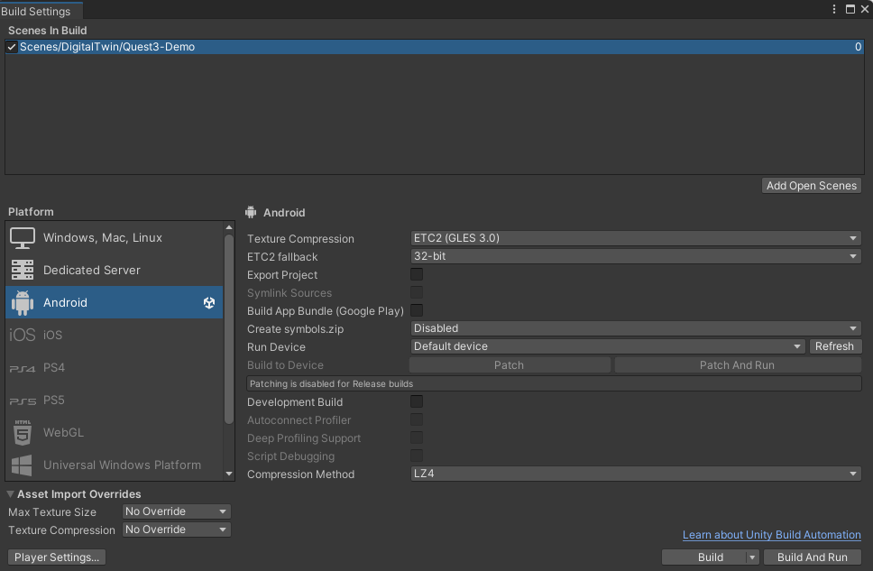
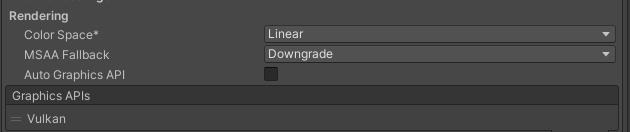
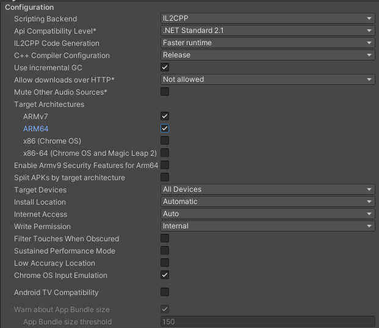
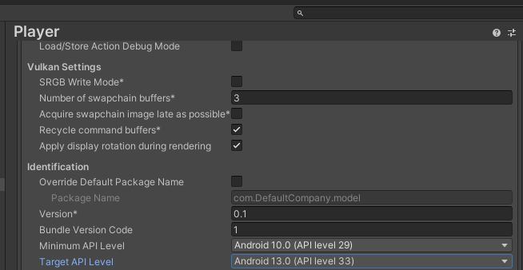
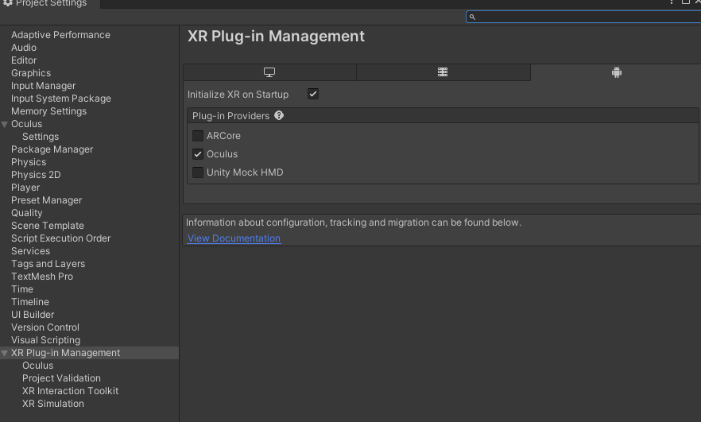
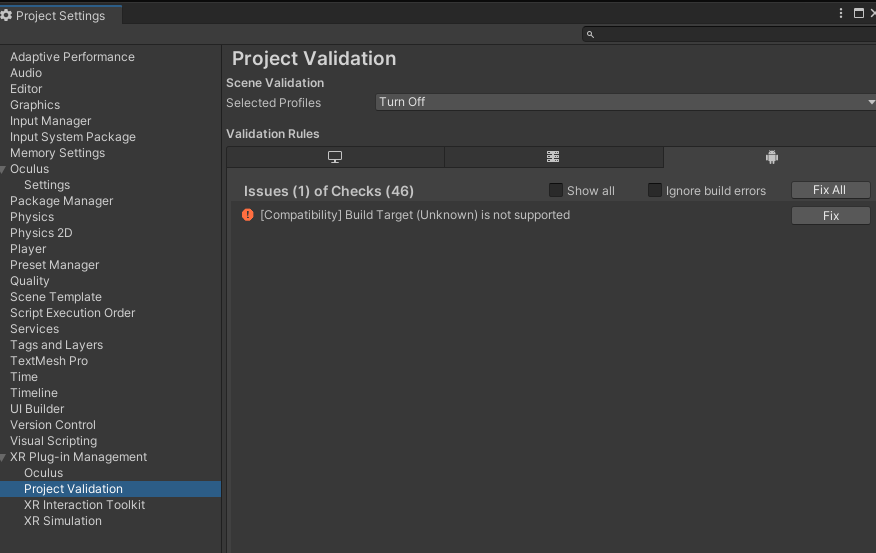
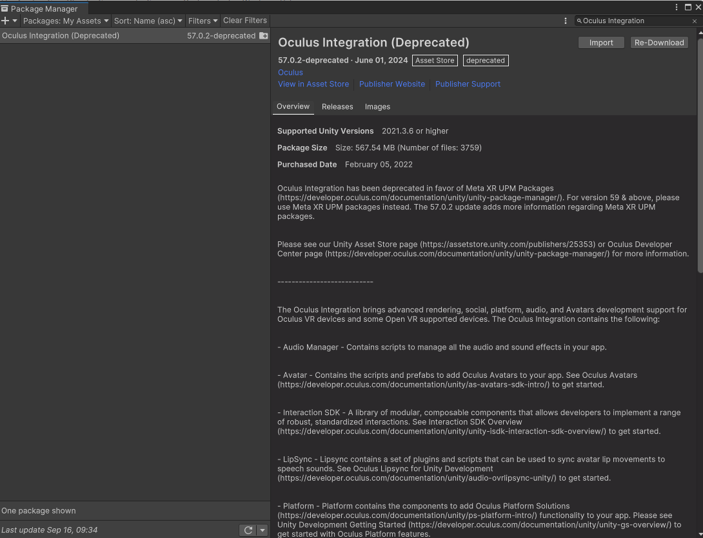
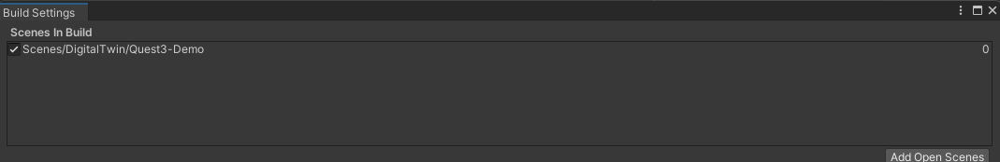
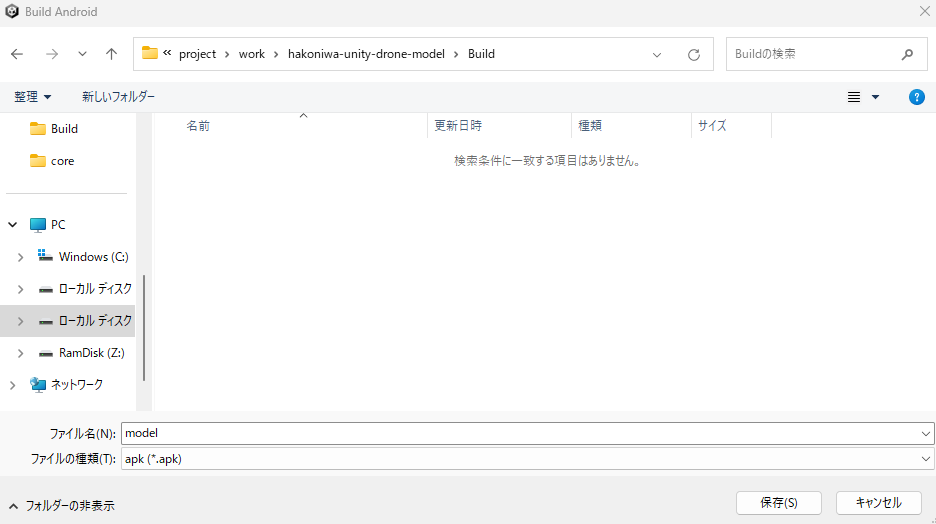

ここでは、QUEST3向けのアプリ作成手順を説明します。

# はじめに

QUEST3向けのUnityアプリを作成する上での基本情報は以下の通りです。

- QUEST3向けのUnityアプリ作成するにはWindows環境で行います。
- QUEST3向けのアプリは Android アプリです。
- QUEST3向けのUnityパッケージが必要となります。

そのため、以下の作業を事前に行う必要があります。

- Android向けのビルド設定 
- Android向けのプロジェクト設定
- QUEST3向けの Unity パッケージのインストール

# 各種設定
## Android向けのビルド設定

File/Build Settings... をクリックして、プラットフォームを Android にしてください。

また、`Texture Compression`を`ETC2(GLES 3.0)`にします。

プラットフォームを切り替えると、コンパイルエラーが出ますので、以下の対応を実施ください。

[gRPC のライブラリ利用箇所がエラー出力している](https://github.com/toppers/hakoniwa-document/tree/main/troubleshooting/unity#grpc-%E3%81%AE%E3%83%A9%E3%82%A4%E3%83%96%E3%83%A9%E3%83%AA%E5%88%A9%E7%94%A8%E7%AE%87%E6%89%80%E3%81%8C%E3%82%A8%E3%83%A9%E3%83%BC%E5%87%BA%E5%8A%9B%E3%81%97%E3%81%A6%E3%81%84%E3%82%8B)

## Android 向けのプロジェクト設定

Edit/Project Settings... をクリックして、Playerを選択してください。

Rendering の設定を下図のようにして下さい。

Configuration の設定を下図のようにして下さい。

Android のAPIレベルを下図のようにしてください。

- Minimum API Level
- Target API Level

XR Plug-in Management を選択し、`Oculus` にチェックを入れます。

XR Plug-in Management/Oculus を選択し、`Quest3` にチェックを入れます。

XR Plug-in Management/Project Validationを選択し、ErrorとWarningがいくつか出ていますので、それぞれ`Fix`します。
ただし、以下のエラーは残りますが、問題ありません。

## QUEST3向けの Unity パッケージのインストール

Window/Package Manager をクリックして、Unity Assetsから、Oculus Integration を選択し、インポートします。

インポート実行中にいろいろと聞かれますので、以下のサイトを参考にしてください。

https://kabaunity.com/ar-art/

## QUEST3向けアプリのビルド

現時点で、QUEST3向けのアプリは以下の２つがあります。

1. Scenes/DigitalTwin/Quest3-Demo
2. Scenes/DigitalTwin/Quest3

本説明では、`1` で説明を進めます。

まず、File/Build Settings... をクリックして、下図のように、Sceneを`Quest3-Demo`に変更します。

次に、`Build`ボタンをクリックすると、ビルド対象ディレクトリとファイル名を聞かれます。

ディレクトリは、`hakoniwa-unity-drone-model`直下に`Build`を作成して、ここにビルドファイルを配置しましょう。

ファイル名は、`model` としましょう。

ビルド開始直後に警告ポップアップがでますが、`Yes` をクリックして続行します。
ちなみに、ビルドは時間がかかりますので、気長に待ちましょう（遅いと３０分くらい）。

ビルドが成功したら、`Run Device` を QUEST3のデバイスIDに設定します。

QUEST3のデバイスIDが表示されない場合は、以下を確認してください。

- PCとQUEST3がUSB接続されているか
- PCのMeta Quest Linkが起動されているか
- QUEST3が開発者モードになっているか
- QUEST3のQuest Linkが有効になっているか
- QUEST3をUSB接続したときに許可しているか
- Reflesh ボタンをクリックしてみる

上記でもダメな場合は、Unityエディタの再起動、QUEST3の再起動を試してみてください。

最後に、`Build and Run` をクリックすると、QUEST3側にアプリがインストールされます。

