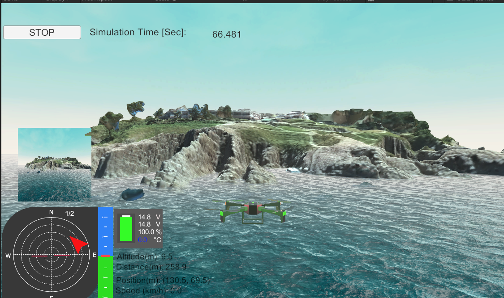
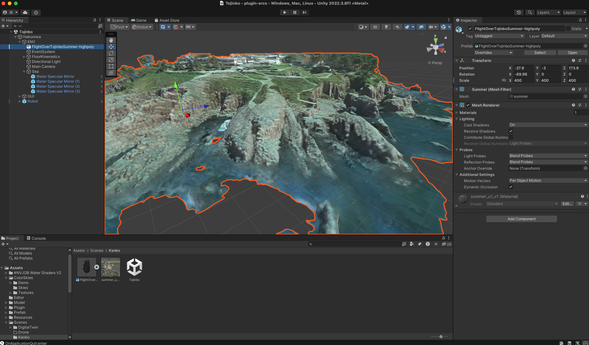

# これは何？

東尋坊 3D モデルを箱庭ドローンシミュレータに組み込む手順を説明します。

出来上がり例：

# 必要なもの

- [箱庭ドローンシミュレータ](https://github.com/toppers/hakoniwa-px4sim)
- 東尋坊 3D モデル ([v2.8.0リリース](https://github.com/toppers/hakoniwa-unity-drone-model/releases/tag/v2.8.0)のFlightOverTojinboSummer.zipです)

# 前提

- 箱庭ドローンシミュレータがインストールされていること
- Unityの基本操作ができること
- Unityシーンの作成方法がわかること
- 箱庭ドローンのUnityシーン差し替えた経験があること([参考](https://www.docswell.com/s/kanetugu2015/KXYR8Y-2024-05-19-160903))

# 手順

- FlightOverTojinboSummer.zipをダウンロードして解凍する
- 解凍されたfbxファイルとpngファイルをUnityにインポートする(お好みのものを選択)
- ApiDemoシーンの風景を差し替える

# 3D設置情報

* 3Dモデル：
  * X: -27.9, Y: -3, Z: 173.9
  * Scale(X: 400, Y: 400, Z: 400)
* Water(Water Specular Mirror)
  * X:0, Y: 0.8, Z: 0
  * Scale:100, 4枚。1000m
* FloorKinematics
  * X:0, Y: -0.76, Z: 0
  * Scale(X: 10000, Y: 1, Z: 10000)

# 参考

おすすめの追加アセット

- [海](https://assetstore.unity.com/packages/vfx/shaders/water-shaders-v2-x-149916)
- [空](https://assetstore.unity.com/packages/2d/textures-materials/sky/colorskies-91541)
- [道](https://assetstore.unity.com/packages/2d/textures-materials/roads/asphalt-materials-141036)
- [木](https://assetstore.unity.com/packages/3d/vegetation/trees/realistic-tree-9-rainbow-tree-54622)
- [鳥](https://assetstore.unity.com/packages/3d/characters/animals/birds/living-birds-15649)
- [船1](https://assetstore.unity.com/packages/3d/vehicles/sea/boats-polypack-189866)
- [船2](https://assetstore.unity.com/packages/3d/vehicles/sea/brig-sloop-sailing-ship-77862)

# 補足

## スカイボックスの適用方法

- メニューから [Window] -> [Rendering] -> [Lighting] を開きます。
- Environment タブを選択します（Unityバージョンによって名称が異なる場合があります）。
- Skybox Material のフィールドに作成したスカイボックスのマテリアルをドラッグ&ドロップします。
