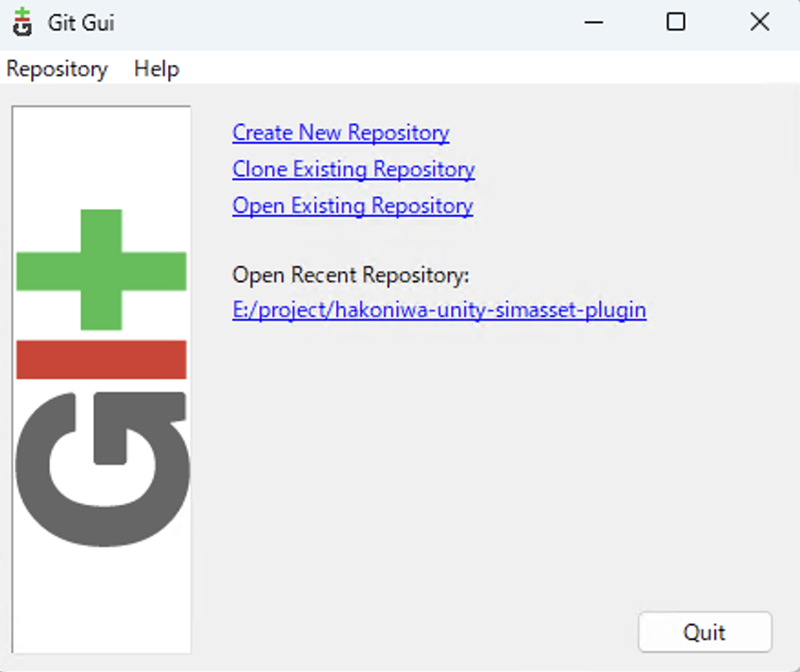
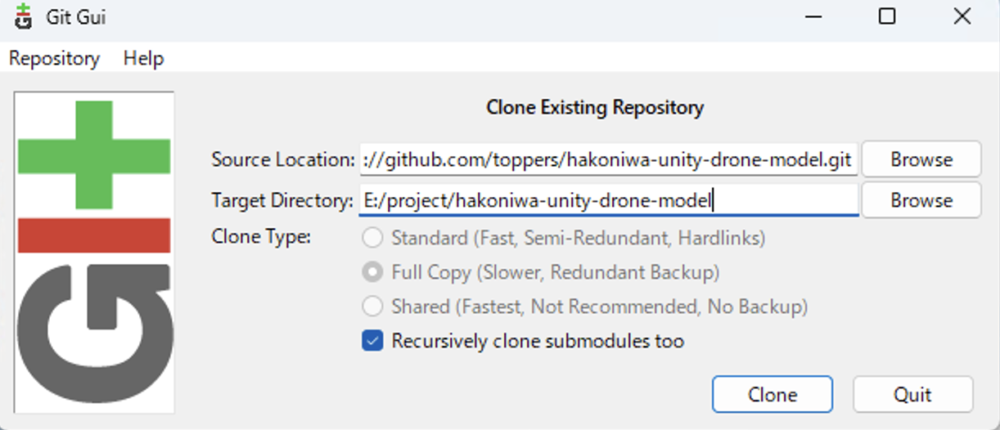
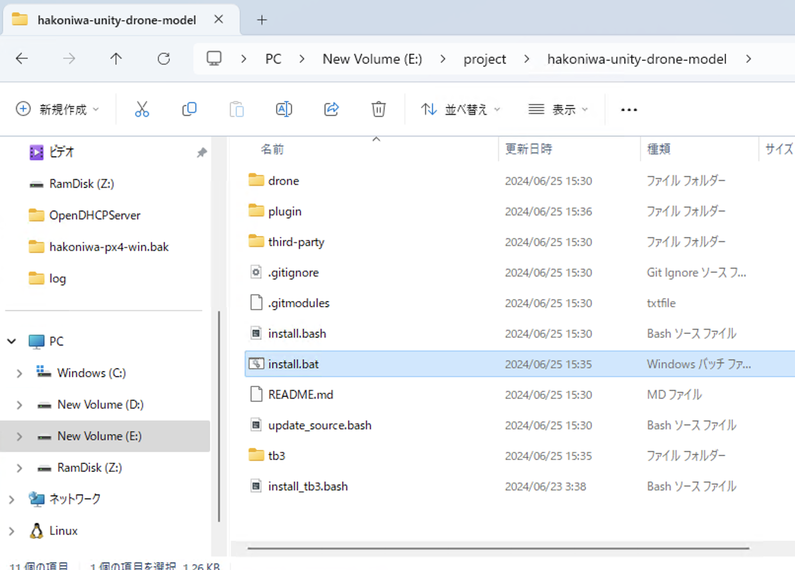
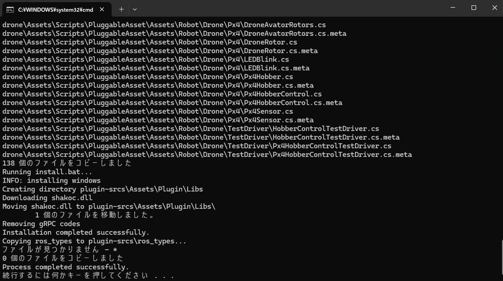
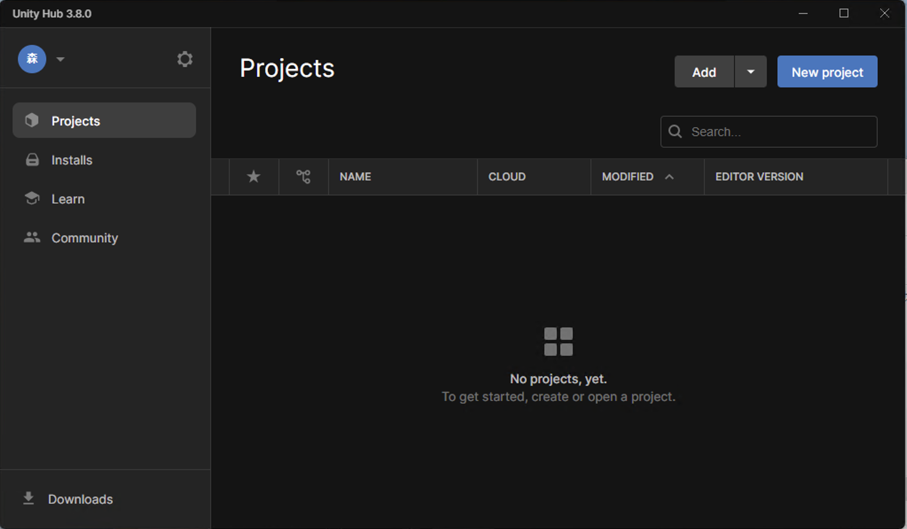
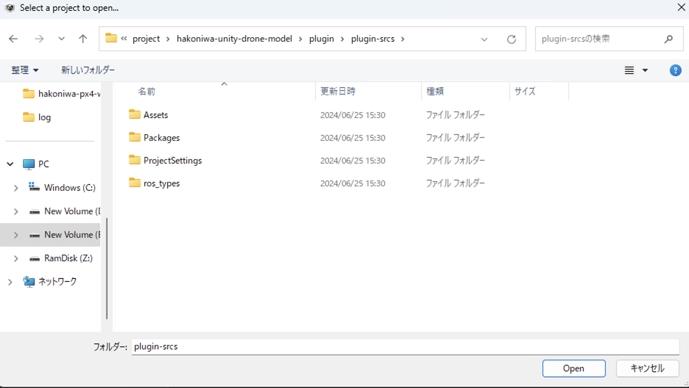
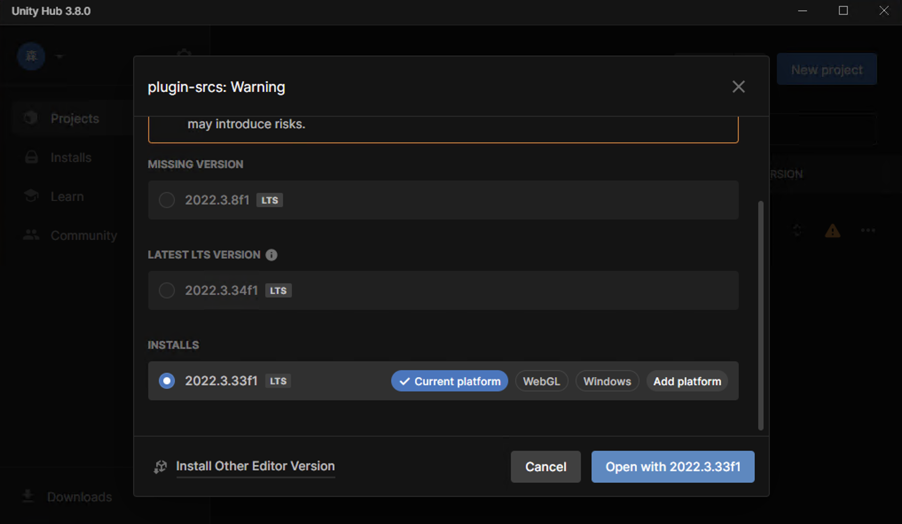
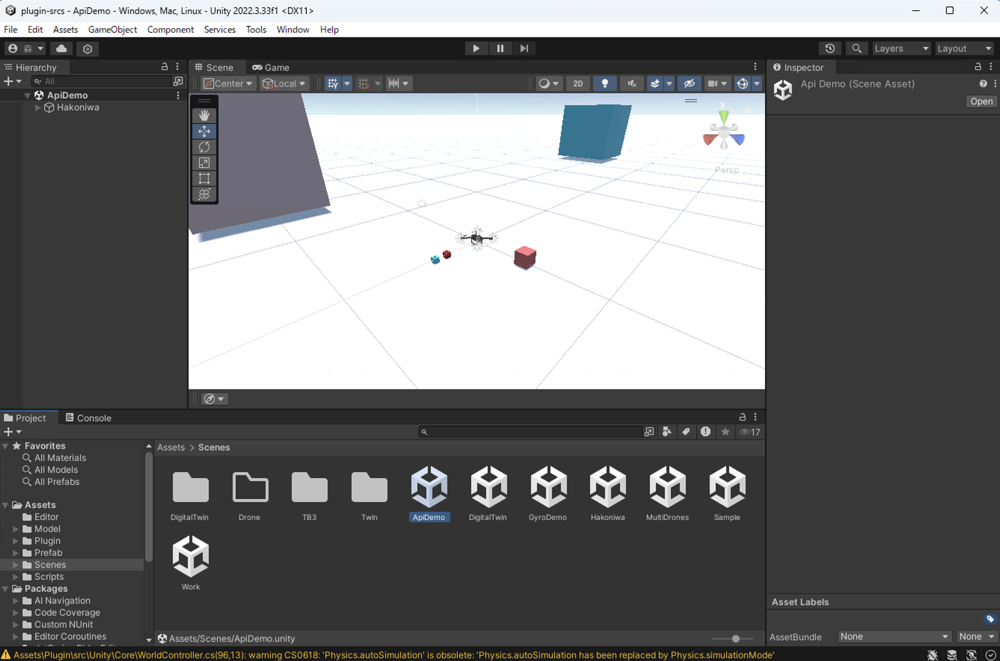
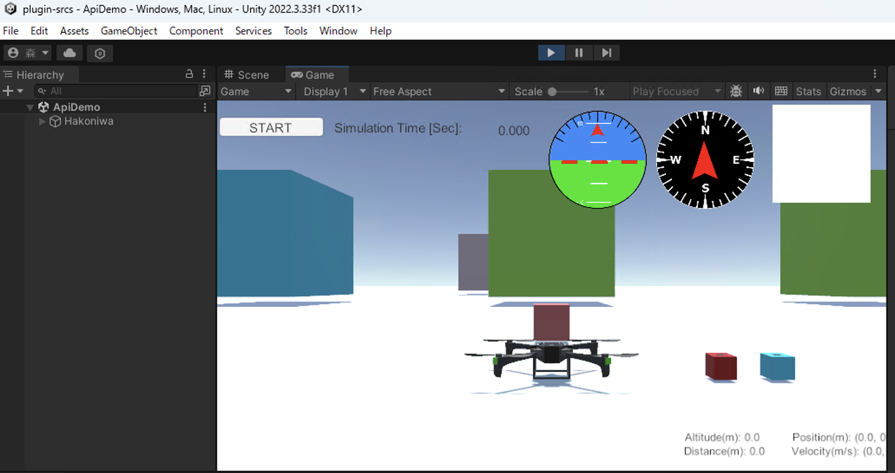
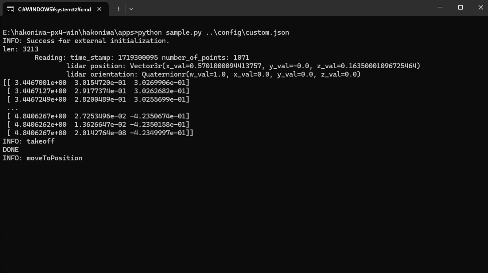

ここでは、Unityエディタを利用したネイティブWindows版の箱庭ドローンシミュレータのインストールおよびシミュレーション実行手順を説明します。

# 目次

- [利用するソフトウェア](#利用するソフトウェア)
- [ネイティブWindows版の箱庭ドローンシミュレータのインストール](#ネイティブwindows版の箱庭ドローンシミュレータのインストール)
- [Unity エディタのセットアップ手順](#unity-エディタのセットアップ手順)
- [Pythonアプリとの連携方法](#pythonアプリとの連携方法)
- [参考：Unity アプリケーションの作成手順](#参考unity-アプリケーションの作成手順)

# 利用するソフトウェア

- [Git for Windows](https://gitforwindows.org/)
- Unity Hub
- Unity
- RAM Disk
- Python
  - Python3.12を前提としています。もし、別のバージョンのPythonを利用されている場合は、競合を回避してPython3.12の環境を構築してください。
- Python ライブラリ
  - numpy

`Git for Windows` のインストールおよび利用方法については、公式サイトを参照ください。

`Git for WIndows`以外のインストール方法は、[箱庭ドローンシミュレータ_事前インストール編_windows版](https://www.jasa.or.jp/dl/tech/drone_simulator_pre-installation_version.pdf)を参照ください。


# ネイティブWindows版の箱庭ドローンシミュレータのインストール

[箱庭ドローンシミュレータ_操作編](https://www.jasa.or.jp/dl/tech/simulator_operation_edition.pdf)の以下を実施して、`hakoniwa-px4-win` をインストールしてください。

- 箱庭ドローンシミュレータの導⼊
- 箱庭ドローンシミュレータ⽤のコンフィグパスの設定

# Unity エディタのセットアップ手順

## Git クローン
Git ツールを利用して、`https://github.com/toppers/hakoniwa-unity-drone-model.git` をクローンしてください。

ここで、クローンするフォルダは、Eドライブの project というフォルダを前提として解説を進めます。



Git Gui で、`Clone Existing Repository` をクリックします。




* Source Location: https://github.com/toppers/hakoniwa-unity-drone-model.git
* Target Directory: E:/project/hakoniwa-unity-drone-model

上記のように設定して、`Clone` をクリックします。

この際、必ず `Recursively clone submodules too` のチェックを入れてください。

成功すると、下図のようにGit管理用の画面に変わります。


## 箱庭のインストール

Windows エクスプローラを開き、クローンしたフォルダを表示してください。



`hakoniwa-unity-drone-model` フォルダの下に、`install.bat` というバッチファイルがありますので、ダブルクリックすると黒い画面が出力されて、箱庭のインストールが実行されます。

成功すると、下図のように、`Process completed successfully`と出力されますので、黒い画面を閉じてください。




## Unityエディタのセットアップ

Unity Hubを起動してください。



`Add` をクリックし、`E:/project/hakoniwa-unity-drone-model/plugin/plugin-srcs` を選択してください。



そのまま選択したプロジェクトを開きましょう。この際、以下のようにバージョンが違う旨のダイアログが出力される場合は、利用されているUnityバージョンを選択して開いてください。自動でバーション変換が行われます。



以下のダイアログが出ますが、`Continue` してください。


次に、以下のダイアログが出ますので、`Ignore` してください。


成功するとこうなります。


起動直後の状態ですと、コンソール上にたくさんエラーが出ていますので、以下のリンク先を参照して、対応してください。

* [gRPC のライブラリ利用箇所がエラー出力している](https://github.com/toppers/hakoniwa-document/blob/main/troubleshooting/unity/README.md#grpc-%E3%81%AE%E3%83%A9%E3%82%A4%E3%83%96%E3%83%A9%E3%83%AA%E5%88%A9%E7%94%A8%E7%AE%87%E6%89%80%E3%81%8C%E3%82%A8%E3%83%A9%E3%83%BC%E5%87%BA%E5%8A%9B%E3%81%97%E3%81%A6%E3%81%84%E3%82%8B)


## 箱庭のセットアップ

プロジェクトビューの`Scenes`を選択して、`ApiDemo`をダブルクリックしてください。成功するとこうなります。



Unityエディタのメニュー `Window/Hakoniwa/Generate` をクリックしてください。

成功すると、コンソール上にエラーログ出力がなく、下図のように json のログが出力されています。


# Pythonアプリとの連携方法

Pythonアプリで箱庭ドローンを操作するためには、先述した `hakoniwa-px4-win` のインストールが必要です。

`hakoniwa-px4-win` のフォルダ内には以下の重要なファイルがあります。

- hakoniwa/apps/sample.py
  - 箱庭ドローンを制御するためのPythonプログラムです。お好みのPythonエディタを使用して、ご自分のプログラムを作成できます。
- hakoniwa/apps/run-sample.bat
  - sample.pyを起動するバッチファイルです。sample.pyを実行するには、このバッチファイルをダブルクリックします。
- hakoniwa/bin/run-api2.bat
  - 箱庭ドローンシミュレータを起動するバッチファイルです。

Pythonアプリを実行して箱庭ドローンシミュレーションを実行する方法は以下の通りです。

## 事前準備

シミュレーション実行するために、事前に以下を実施ください。

1. Windowsエクスプローラで、`hakoniwa-px4-win/hakoniwa/bin/` を開きます。
2. 別のWindowsエクスプローラで、`hakoniwa/apps` を開きます。
3. 先述した手順でセットアップ完了したUnityエディタを開きます。


## シミュレーション実行方法


`hakoniwa/bin/run-api2.bat`をダブルクリックします。

成功すると、下図の黒画面が出力されます。


次に、Unityエディタのシミュレーション開始ボタンをクリックします。

成功すると、下図のようにゲームビューに切り替わりますので `START`ボタンをクリックします。



最後に、`hakoniwa/apps/run-sample.bat` をダブルクリックすると、以下の黒画面が出力され、箱庭ドローンが動き出します。



## シミュレーション停止方法

シミュレーションを終了するには、以下の手順で停止してください。

1. Unityエディタのシミュレーション停止ボタンを押下します。
2. `hakoniwa/apps/run-sample.bat`の黒画面を閉じます。
3. `hakoniwa/bin/run-api2.bat`の黒画面を閉じます。

# 参考：Unity アプリケーションの作成手順

Unityエディタ上で `ApiDemo` シーンのUnityアプリケーションを作成するための手順です。

1. Unity の Editor/Project Settings/Quality でアプリケーションの設定をする
2. Unity の Editor/Project Settings/Player でアプリケーションの設定をする
3. Unity アプリケーションをビルドする
4. 箱庭の各種設定ファイルをコピーする


## 前提

事前に、Unityエディタの箱庭シーンから、箱庭のコンフィグファイルを `Generate` してください。

Generateすると、`plugin-srcs` 直下に、以下のファイルが出力されます。

```
HakoniwaSimTime.json
LoginRobot.json
RosTopics.json
core_config.json
custom.json
hakoniwa_path.json
inside_assets.json
pdu_channel_connector.json
pdu_configs.json
pdu_readers.json
pdu_writers.json
reader_connector.json
rpc_methods.json
shm_methods.json
writer_connector.json
```

## Unity の Editor/Project Settings/Quality でアプリケーションの設定をする

Quality の設定は、デフォルトですと、`Ultra` になっています。


パソコンの性能が気になる方は、`Very Low` だけ残して、その他は削除することをお勧めします。


## Unity の Editor/Project Settings/Player でアプリケーションの設定をする

Player の設定は、デフォルトですと、下図のようになっています。


以下の項目を変更しましょう。

* Fullscreen Mode
  * Windowed に変更して、Width と Height をお好みの値にしてください。
    * ここでは、1024x640 にします。 
* Resizable Window
  * この項目をチェックすることで、Windowサイズを調整できるようになります。


## Unity アプリケーションをビルドする

File/Build Settings を開き、Add Open Scenes でアプリケーション化したいシーンを選択します。

デフォルトですと、TB3Workが選択されていますので、削除して、ApiDemoを選択します。

その後、Build ボタンをクリックします。

下図のようにダイアログがポップアップされますので、ビルドした結果を格納するディレクトリを選択します。ディレクトリ名は、DroneAppWinとしてください。

成功すると、下図のようにアプリケーションの実行ファイル(model.exe)が生成されます。


## 箱庭の各種設定ファイルをコピーする

前提とする操作で `Generate` した各種設定ファイル（jsonファイル）一式を、ビルドした結果を格納しているディレクトリにコピー配置しましょう。

次に、`plugin-srcs` 配下にある `ros_types` ディレクトリを同様にコピー配置しましょう。


## Unityアプリケーションを利用したシミュレーション実行手順

Unityアプリケーションでシミュレーション実行するために、事前に以下を実施ください。

1. Windowsエクスプローラで、`hakoniwa-px4-win/hakoniwa/bin/` を開きます。
2. 別のWindowsエクスプローラで、`hakoniwa-px4-win/hakoniwa/apps` を開きます。
3. 別のWindowsエクスプローラで、`DroneAppWin` を開きます。


### シミュレーション実行方法

1. `hakoniwa/bin/run-api2.bat`をダブルクリックします。
2. `DroneAppWin`の `model.exe` をダブルクリックし、アプリケーションを起動させ、`START`ボタンをクリックします。
3. `hakoniwa/apps/run-sample.bat` をダブルクリックすると、以下の黒画面が出力され、箱庭ドローンが動き出します。

### シミュレーション停止方法

シミュレーションを終了するには、以下の手順で停止してください。

1. Unityアプリケーションを閉じます。
2. `hakoniwa/apps/run-sample.bat`の黒画面を閉じます。
3. `hakoniwa/bin/run-api2.bat`の黒画面を閉じます。